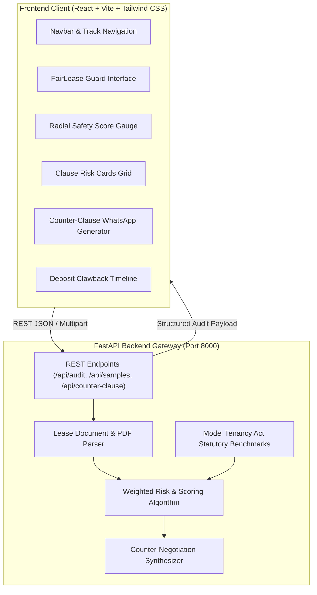

# RentFair AI 🛡️ — Next-Gen PropTech & Living Space Platform
> **Technofora '26 CodeCraft Hackathon** | ISA Students' Chapter, Nirma University  
> **Track:** PropTech (Next-Gen Real Estate & Living Space Management)

[](https://opensource.org/licenses/MIT)
[](https://fastapi.tiangolo.com)
[](https://reactjs.org/)
[](https://tailwindcss.com/)

---

## 1. Problem Statement
Finding, leasing, and living in shared residential or commercial spaces involves substantial friction, especially for first-time renters, students, and young working professionals. The key pain points identified in the official Technofora '26 PropTech track include:
1. **Opaque contractual agreements** with hidden traps, arbitrary rent hikes, and deposit forfeiture.
2. **Difficulty finding compatible housemates** leading to costly co-living conflicts.
3. **Delayed property maintenance** and disputes over repair liabilities.
4. **Poor transparency in living costs and property valuations**, where advertised rent masks the true monthly outflow.

---

## 2. Proposed Solution: RentFair AI
**RentFair AI** is a unified, accessible web ecosystem engineered to bring transparency, fairness, and automated digital workflows to modern living spaces. 

### Core Pillars:
1. **🛡️ FairLease Guard (Feature 1 - Implemented & Active):**
   * Instant legal audit of rental agreements (PDF or text) against the **Model Tenancy Act (MTA), 2021**.
   * Deterministic **FairLease Safety Score (0–100)** with radial gauge visualizer.
   * Plain-English clause translations exposing who pays for what.
   * Automated **Diplomatic Counter-Clause & WhatsApp Negotiation Drafter** to push back on unfair terms.
   * **Deposit Clawback Timeline Tracker** outlining legal refund milestones.
2. **🤝 HarmonyMatch (Pillar 2 - Architecture Ready):**
   * Multi-dimensional lifestyle vector compatibility engine using weighted Cosine Similarity to prevent flatmate friction.
   * Auto-generated downloadable "Roommate Living Charter".
3. **🔧 SnapFix Triage (Pillar 3 - Architecture Ready):**
   * Computer-vision damage triage classifying urgency and estimating fair repair costs in INR.
   * Cryptographic move-in condition proof to protect deposits from wrongful deductions.
4. **📊 TrueCost Index (Pillar 4 - Architecture Ready):**
   * Total Cost of Living calculator aggregating rent, society maintenance, utility projections, and deposit opportunity costs.

---

## 3. Technology Stack & Frameworks

### Frontend:
* **Framework:** React 18 + Vite + TypeScript
* **Styling:** Tailwind CSS with modern glassmorphism design tokens
* **Icons:** Lucide React
* **Typography:** Plus Jakarta Sans

### Backend & AI:
* **Framework:** FastAPI (Python 3.11+)
* **Document Processing:** PyPDF & regex structural parser
* **Legal Engine:** Rule-based statutory NLP matching engine referencing Model Tenancy Act (MTA) benchmarks
* **AI Enhancer:** Optional Google Gemini API for generative counter-negotiation synthesis
* **Server:** Uvicorn ASGI

---

## 4. System Architecture



---

## 5. API Endpoints

| Method | Endpoint | Description |
| :--- | :--- | :--- |
| `GET` | `/` | Health check & service metadata |
| `GET` | `/api/samples` | Pre-loaded realistic lease agreements (Predatory, Safe, PG) |
| `POST` | `/api/audit/text` | Analyzes pasted lease agreement text |
| `POST` | `/api/audit/upload` | Extracts and audits uploaded PDF / TXT document |
| `POST` | `/api/counter-clause` | Generates tailored counter-proposals with custom negotiation tones |

---

## 6. Setup & Installation Instructions

### Prerequisites:
* Python 3.10 or higher
* Node.js v18 or higher (tested on Node v25 & npm 11)
* Git

### Option A: One-Click Launch (Windows)
Simply double-click:
```bash
run_project.bat
```
This script automatically sets up the Python virtual environment, installs dependencies, launches the backend and frontend concurrently, and opens your browser.

---

### Option B: Manual Setup

#### 1. Backend Setup:
```bash
cd backend
python -m venv venv
venv\Scripts\activate   # On Linux/macOS: source venv/bin/activate
pip install -r requirements.txt
python main.py
```
*Backend runs on `http://127.0.0.1:8000` (Swagger docs available at `http://127.0.0.1:8000/docs`).*

#### 2. Frontend Setup:
```bash
cd frontend
npm install
npm run dev
```
*Frontend runs on `http://localhost:5173`.*

---

## 7. Testing & Verification
Unit tests are included to verify that predatory clauses, balanced terms, and student contracts are accurately evaluated:

```bash
cd backend
venv\Scripts\activate
pytest tests/ -v
```

---

## 8. Compliance & Hackathon Disclosures (Rule #11 & #12)
* **AI Tools Disclosure:** Generative AI tools were utilized for brainstorming boilerplate code and rapid design generation, accelerated under Pair Programming guidelines. Core statutory rules, legal heuristics, risk weighting equations, and UX flows were curated by the team.
* **Open Source & Third-Party:** Leveraged FastAPI, React, Vite, Tailwind CSS, Lucide Icons, and PyPDF under MIT / permissive open-source licenses.
* **Secrets Handling:** Compliant with Rule #10 — zero keys committed. Configuration is managed strictly via `.env` and `.env.example`.
