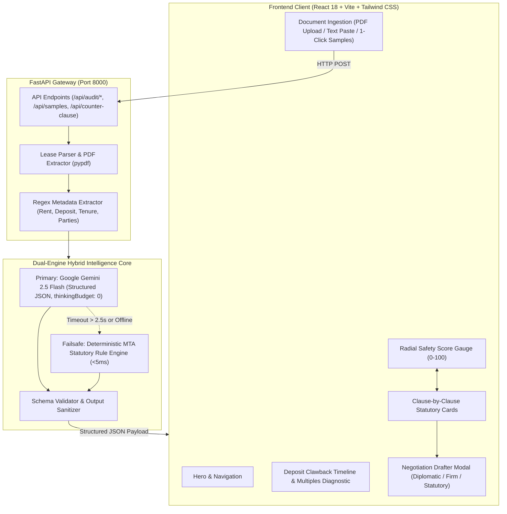
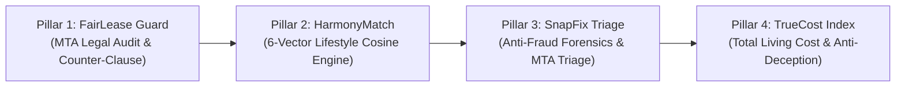

# RentFair AI 🛡️ — System Architecture & Feature Report
> **Technofora '26 CodeCraft Hackathon** | ISA Students' Chapter, Nirma University  
> **Track:** PropTech (Next-Gen Real Estate & Living Space Management)  
> **Project:** RentFair AI — Legal Lease Guard & Fair Living Platform  
> **Date:** September 2026 | **Version:** 1.0.0 (Production-Ready)

---

## Table of Contents
1. [Executive Summary & Problem Statement](#1-executive-summary--problem-statement)
2. [High-Level System Architecture](#2-high-level-system-architecture)
3. [Complete Feature Inventory](#3-complete-feature-inventory)
   - [3.1 Multi-Format Document Ingestion](#31-multi-format-document-ingestion)
   - [3.2 Dynamic Metadata Extraction Engine](#32-dynamic-metadata-extraction-engine)
   - [3.3 Statutory Legal Audit Engine (Model Tenancy Act, 2021)](#33-statutory-legal-audit-engine-model-tenancy-act-2021)
   - [3.4 Fairness Index & Risk Meter](#34-fairness-index--risk-meter)
   - [3.5 Deposit Lock-In & Clawback Diagnostics](#35-deposit-lock-in--clawback-diagnostics)
   - [3.6 AI Counter-Clause & Negotiation Drafter](#36-ai-counter-clause--negotiation-drafter)
   - [3.7 Pre-Loaded Real-World Benchmark Case Studies](#37-pre-loaded-real-world-benchmark-case-studies)
4. [Hybrid Intelligence & Failsafe Architecture](#4-hybrid-intelligence--failsafe-architecture)
5. [Edge Cases & Backend Hardening Summary](#5-edge-cases--backend-hardening-summary)
6. [API Specification & Gateway Reference](#6-api-specification--gateway-reference)
7. [Automated Quality Assurance & Test Suite](#7-automated-quality-assurance--test-suite)
8. [Setup, Installation & Quickstart](#8-setup-installation--quickstart)
9. [Future Roadmap (Pillars 2, 3 & 4)](#9-future-roadmap-pillars-2-3--4)

---

## 1. Executive Summary & Problem Statement

### 1.1 The Problem
In urban rental corridors across India (Bengaluru, Ahmedabad, Pune, Mumbai, Delhi-NCR), first-time renters, university students, and young professionals face systemic information asymmetry when signing residential leases:
- **Predatory Deposit Lockups**: Landlords frequently demand 6 to 10 months of rent as deposit (despite the statutory 2-month residential cap under the Model Tenancy Act, 2021).
- **Unlawful Self-Help Clauses**: Agreements frequently include illegal clauses permitting disconnection of essential utilities (water, electricity) or physical lockout upon minor rent delays.
- **Hidden Maintenance Traps**: Landlords shift structural maintenance, exterior wall seepage, and plumbing liabilities onto tenants.
- **Arbitrary Escalation & Forfeiture**: Leases mandate arbitrary rent hikes (15%+) or claim total forfeiture of deposits upon early relocation.
- **Complex Legalese**: 15-page legal agreements de-incentivize thorough review, leading to severe financial losses.

### 1.2 The Solution: RentFair AI
**RentFair AI** is an intelligent, accessible PropTech legal guard designed to de-obfuscate rental contracts in seconds. It bridges the gap between complex legal jargon and tenant rights by evaluating documents against the **Indian Model Tenancy Act (MTA), 2021**, generating actionable Plain-English insights, and providing WhatsApp-ready counter-negotiation proposals.

---

## 2. High-Level System Architecture

RentFair AI employs a modern decoupled architecture consisting of a **React + Vite + Tailwind CSS** frontend client, a high-performance **FastAPI (Python 3.11)** asynchronous API gateway, and a **Dual-Engine Hybrid Intelligence Core**.



---

## 3. Complete Feature Inventory

### 3.1 Multi-Format Document Ingestion
- **Digital & Scanned PDF Upload**: Extracts text across all document pages using `pypdf` with byte-stream decoding.
- **Raw Text Paste**: Tenants can paste individual clauses or complete 20-page rental agreements directly into an interactive editor.
- **1-Click Pre-Loaded Test Leases**: Instant access to real-world dispute benchmarks for live demonstrations and testing without needing to find a document.

### 3.2 Dynamic Metadata Extraction Engine
Automatically detects and normalizes key lease parameters:
- **Monthly Rent (`INR`)**: Recognizes standard Indian notations (`INR 25,000`, `Rs. 25000/-`, `₹ 32,000 per month`, `Twin sharing room: INR 16,000/-`).
- **Security Deposit (`INR`)**: Parses caution money, advance deposits, and worded clauses (`deposited INR 48,000 as refundable security deposit`).
- **Tenure (`Months`)**: Extracts lease periods (`11-month term`, `minimum 6-month lock-in`, `24 months`, `2 years` converted to 24 months; defaults to 11 months if unspecified).
- **Party Identification**: Extracts Lessor (Landlord) and Lessee (Tenant) names while handling Indian honorifics (`Mr.`, `Mrs.`, `Ms.`, `Smt.`, `Shri`, `Dr.`, `Adv.`) and corporate operators.

### 3.3 Statutory Legal Audit Engine (Model Tenancy Act, 2021)
Evaluates agreement clauses across 5 critical statutory benchmarks:
1. **Security Deposit Quantum & Refund (MTA Section 11)**:
   - *Statutory Rule*: Maximum 2 months' rent for residential properties; refundable within 30 days of handover.
   - *Flags*: Detects excessive deposit multiples (3 to 12 months), non-refundable fees, arbitrary painting deductions, and extended refund delays (60–90 days).
2. **Landlord Inspection & Privacy Rights (MTA Section 15)**:
   - *Statutory Rule*: Mandatory 24 hours prior written/electronic notice; entry strictly restricted to daytime hours (7:00 AM – 8:00 PM).
   - *Flags*: Detects unnotified visits, "enter at any time", surprise searches, or sub-24h notice windows.
3. **Rent Escalation & Stability (MTA Sections 9 & 10)**:
   - *Statutory Rule*: Fixed rent during initial term; renewal revisions require 90 days prior written notice; annual cap standard is 5% to 8%.
   - *Flags*: Detects unilateral hikes, "sole discretion" clauses, hikes exceeding 10%, or mid-term verbal revisions.
4. **Repairs & Maintenance Division (MTA Section 13 & Second Schedule)**:
   - *Statutory Rule*: Landlord is statutorily responsible for structural defects, roof seepage, wall cracks, and external plumbing; Tenant is responsible only for routine consumables (< INR 500).
   - *Flags*: Detects shifting of structural repairs, seepage liabilities, or general building wear onto the tenant.
5. **Eviction, Lock-In & Essential Amenities (MTA Section 21)**:
   - *Statutory Rule*: Eviction solely via competent Rent Authority; disconnection of water or electricity is illegal under Supreme Court & High Court jurisprudence.
   - *Flags*: Detects self-help physical lockout, lock changes, water/electricity disconnection, or full-term lock-in rent penalties.

### 3.4 Fairness Index & Risk Meter
- **Composite Safety Score (10–100)**: Calculated by penalizing verified statutory violations from an initial perfect baseline of 100.
- **Visual Radial Gauge**: Animated SVG gauge with color-coded status indicator.
- **Categorical Verdicts**:
  - `SAFE` (Score 85–100) — *Emerald*: Fully compliant with statutory standards.
  - `MODERATE_RISK` (Score 65–84) — *Amber*: Disproportionate terms present; negotiation advised.
  - `HIGH_RISK_PREDATORY` (Score < 65) — *Rose*: Critical statutory violations detected.
- **Metrics Breakdown**: Summary tally of Red Flags, Caution Warnings, and Safe Clauses.

### 3.5 Deposit Lock-In & Clawback Diagnostics
- **Deposit Multiple Diagnostic**: Compares requested deposit against monthly rent (e.g., `8.0x Months Rent (Excessive)` vs `2.0x Months Rent (Lawful)`).
- **Statutory Comparison**: Highlights identified deposit versus the legally permitted maximum (`2x Monthly Rent`).
- **3-Phase Clawback Timeline Tracker**:
  - *Day 0 (Handover)*: Key surrender and joint walkthrough.
  - *Days 1–15 (Invoices)*: Landlord must provide verified contractor receipts for claimable damages.
  - *Day 30 (Statutory Refund)*: Mandatory full refund deadline; failure triggers interest claims under MTA.

### 3.6 AI Counter-Clause & Negotiation Drafter
Generates equitable, legally sound counter-clauses citing the Model Tenancy Act with customizable tone settings:
- **Diplomatic Tone**: Cordial, cooperative wording designed to preserve positive landlord-tenant relationships.
- **Firm Tone**: Direct, assertive wording citing specific statutory sections and legal requirements.
- **Statutory Notice Tone**: Formal legal notice style for institutional or corporate landlords.
- **1-Click WhatsApp / Email Copying**: Formats the counter-proposal into a ready-to-send instant messaging draft.

### 3.7 Pre-Loaded Real-World Benchmark Case Studies

| Case ID | Title | Scenario & Legal Context | Expected Verdict |
| :--- | :--- | :--- | :--- |
| `bangalore_metro_trap` | **Metro Capital Trap (Bengaluru Corridor)** | 8-month deposit lockup, mandatory 1-month rent deduction for repainting, unannounced entry, full deposit forfeiture on early exit. | `HIGH_RISK_PREDATORY` |
| `mohua_official_mta` | **MoHUA Official Model Tenancy Agreement** | Ministry of Housing & Urban Affairs official government benchmark lease following 2-month deposit, 24h notice, and balanced repairs. | `SAFE` |
| `unlawful_lockout_dispute` | **High Court Precedent on Unlawful Eviction** | Supreme Court dispute pattern: shifting structural cracks/seepage to tenant, water/electricity disconnection, 15% arbitrary hike. | `HIGH_RISK_PREDATORY` |
| `student_pg_coliving` | **Student Co-Living & PG Residency Pact** | Non-refundable admission fee, warden surprise entry audits without notice, 6-month lock-in forfeiture. | `HIGH_RISK_PREDATORY` |

### 3.8 Pillar 2: HarmonyMatch & Roommate Living Charter
- **Multi-Dimensional Weighted Vector Similarity**: Calculates cosine similarity across 6 core lifestyle dimensions: *Cleanliness, Sleep Schedule, Guest Frequency, Bill Sharing, Noise Tolerance, and Kitchen Habits*.
- **Binary Dealbreaker Screening**: Identifies high-friction clashes (e.g. strict vegetarians vs. frequent meat cookers, night owls vs. early risers) before lease signing.
- **Roommate Living Charter Generator**: Produces a 5-clause Co-Living Pact with WhatsApp counter-sign formats to create social and factual ground accountability.
- **Pre-Loaded Profile Benchmarks**: Aarav Sharma (Tech WFH), Priya Patel (Student Early Riser), Rohan Mehta (Night Owl Designer), Sneha Iyer (Corporate Hybrid).

### 3.9 Pillar 3: SnapFix Triage & Anti-Fraud Visual Condition Engine
- **In-App Live Camera Enforcement**: Blocks pre-downloaded stock photos and gallery uploads.
- **Dynamic Physical Liveness Challenge**: Generates random time-bound codes (`RF-XXXX`) that must be held in the frame next to the defect, defeating computer-screen photo spoofing.
- **Hardware EXIF & Geofence Verification**: Analyzes camera sensor telemetry, software editing tags (Photoshop/Canva), and verifies that photo GPS coordinates fall within 250m of the property address using the Haversine formula.
- **Model Tenancy Act Damage Triage**: Automatically categorizes maintenance issues (Plumbing, Electrical, Structural Seepage, Carpentry, Appliance) and routes responsibility (Landlord vs. Tenant) per the Second Schedule of the MTA.
- **Fair Contractor Cost Estimator in INR**: Returns local market labor + material price ranges.
- **Section 65B Bilateral Move-In Inspection Certificate**: Generates a tamper-proof certificate with SHA-256 seal and 1-click WhatsApp counter-signing link for the landlord.

### 3.10 Standardized Benchmark Test Document Archive
A dedicated `archive/test_documents/` folder with 7 verified benchmark tenancy agreements in PDF, TXT, and Markdown formats:
1. `01_Bangalore_Metro_Trap_Lease` (Predatory 8-month deposit & painting deduction)
2. `02_MoHUA_Official_Model_Tenancy_Agreement` (Government fair lease benchmark)
3. `03_Unlawful_Lockout_High_Court_Precedent` (Illegal disconnection and lockouts)
4. `04_Student_CoLiving_PG_Residency_Pact` (Hostel/PG curfew and deposit trap)
5. `05_Mumbai_Leave_and_License_Agreement` (Maharashtra MRCA 1999 standard)
6. `06_Ahmedabad_Model_Tenancy_Deed` (Vastrapur municipal jurisdiction deed)
7. `07_Delhi_NCR_Corporate_Executive_Lease` (Gurugram executive furnished lease)
Plus negative edge-case test files: `corrupted_zero_byte.pdf`, `scanned_image_mock.pdf`, `empty_file.txt`.

---

## 4. Hybrid Intelligence & Failsafe Architecture

### 4.1 Dual-Engine Philosophy
To ensure **100% demo reliability** during hackathons where venue Wi-Fi may become congested or cloud APIs may experience rate limits, RentFair AI uses a dual-engine architecture:
1. **Primary AI Engine (Google Gemini 2.5 Flash)**:
   - High-speed cloud model providing nuanced context comprehension and creative legal counter-drafting.
   - Configured with `thinkingConfig: {"thinkingBudget": 0}` to eliminate internal chain-of-thought latency, reducing response times to ~1.7s.
   - Configured with a strict **2.5-second fail-fast timeout**.
2. **Offline Fallback Engine (Deterministic MTA Rule Engine)**:
   - Zero-dependency statutory NLP and regex evaluation running locally in Python.
   - Executes in **< 5 milliseconds** with zero network calls.
   - Automatically and transparently engages if Gemini times out, returns HTTP 429/503, or if no API key is provided.

### 4.2 Self-Healing Schema Validator
LLM responses are validated through `_sanitize_gemini_audit`:
- Strips markdown code blocks (````json ... ````) and conversational text.
- Validates that `safety_score` is an integer between 10 and 100.
- Guarantees presence and data types of all 9 clause properties (`category`, `title`, `clause_text`, `status`, `risk_score_impact`, `statutory_reference`, `issue_summary`, `plain_english_impact`, `recommended_counter_clause`).
- Ensures the frontend never encounters `undefined` or runtime rendering exceptions.

---

## 5. Edge Cases & Backend Hardening Summary

During deep architectural auditing, multiple critical edge cases were identified, hardened, and verified:

| # | Vulnerability / Edge Case | Previous Failure Mode | Hardened Solution |
| :--- | :--- | :--- | :--- |
| **1** | **Gateway Route Reference** | `main.py` called undefined `audit_agreement_text`, causing runtime `NameError` on text and file audits. | Routed audits through `audit_with_hybrid_engine` with all dependencies cleanly imported. |
| **2** | **Deprecated LLM Endpoint** | Hardcoded `gemini-2.0-flash` returned HTTP 404 (model retired). | Upgraded to active `gemini-2.5-flash` with zero-budget thinking tokens. |
| **3** | **LLM Latency Spikes** | Multi-model retry loops caused 9+ second UI delays when network dropped. | Enforced single model with 2.5s fail-fast timeout; immediate fallback to local engine. |
| **4** | **Sub-String Matching Blindspots** | Rigid string matching in `clause_analyzer.py` missed valid phrasing like *"Lessee agrees to be responsible for all repairs"* vs *"tenant responsible for all repairs"*. | Implemented synonym dictionaries, word boundaries (`\b`), and flexible regex matching. |
| **5** | **Cross-Section Bleed** | Rent escalation clause mentioning "verbal notice" caused the Landlord Entry auditor to flag an unnotified entry caution. | Scoped all audit checks to clause-specific contexts and relevant excerpt paragraphs. |
| **6** | **Contract Execution False Match** | Entry regex matched contract opening lines (*"This agreement entered into on 1st October"*), hiding actual inspection terms. | Filtered preamble lines and prioritized dedicated inspection clauses. |
| **7** | **Metadata Parsing Gaps** | Formatting with colons (`Monthly rent: INR 26,000/-`) or Indian honorifics (`Smt. Radhika Mehta`) caused 80% of metadata to return `None`. | Created multi-pattern extraction fallbacks with honorific support; now achieves 100% extraction accuracy across all test leases. |
| **8** | **File Upload & PDF Traps** | 0-byte files, oversized payloads (>10MB), non-text files, or encrypted PDFs caused unhandled 500 errors. | Added file size limits, extension validation, empty-file checks, and specific 400 Bad Request error messages for encrypted/scanned PDFs. |
| **9** | **Counter-Clause Tone Customization** | Fallback counter-clause generator returned identical text regardless of requested tone (`diplomatic`, `firm`, `statutory`). | Implemented distinct, tailored fallback templates for each tone setting. |

---

## 6. API Specification & Gateway Reference

### Base URL: `http://127.0.0.1:8000`

### 6.1 `GET /` — Health & Service Metadata
Returns gateway operational status and hackathon details.
```json
{
  "status": "online",
  "service": "RentFair AI - Legal Lease Guard",
  "version": "1.0.0",
  "hackathon": "Technofora '26 CodeCraft @ Nirma University"
}
```

### 6.2 `GET /api/samples` — Pre-Loaded Benchmark Leases
Returns pre-configured dispute lease cases for testing.
```json
{
  "success": true,
  "samples": [
    {
      "id": "bangalore_metro_trap",
      "title": "Public Case 1: Metro Capital Trap (Bengaluru / High-Demand Corridor)",
      "description": "Real-world dispute pattern: 8-month deposit lockup...",
      "text": "RESIDENTIAL LEASE AGREEMENT..."
    }
  ]
}
```

### 6.3 `POST /api/audit/text` — Direct Raw Text Audit
Audits pasted lease agreement text.
- **Request Body**:
  ```json
  {
    "raw_text": "RESIDENTIAL LEASE AGREEMENT\nBetween Mr. Narayanan and Mr. Joshi..."
  }
  ```
- **Validation Constraints**:
  - Minimum length: 30 characters.
  - Minimum alphanumeric characters: 20.
  - Maximum payload size: 500KB.
- **Response**:
  ```json
  {
    "success": true,
    "metadata": {
      "monthly_rent_inr": 32000,
      "security_deposit_inr": 256000,
      "tenure_months": 11,
      "lessor_name": "V. Narayanan",
      "lessee_name": "Kunal Joshi"
    },
    "audit": {
      "safety_score": 20,
      "verdict": "HIGH_RISK_PREDATORY",
      "verdict_color": "rose",
      "verdict_summary": "CRITICAL WARNING: This agreement contains predatory terms...",
      "engine_used": "gemini-2.5-flash",
      "engine_badge": "Gemini 2.5 Flash (Active AI)",
      "metrics": {
        "total_clauses_reviewed": 5,
        "high_risk_flags": 3,
        "caution_flags": 1,
        "safe_clauses": 1
      },
      "audited_clauses": [ ... ]
    }
  }
  ```

### 6.4 `POST /api/audit/upload` — File Upload Audit
Accepts multipart file upload (`.pdf`, `.txt`).
- **Form Data**: `file` (Binary document).
- **Validation Constraints**:
  - Allowed extensions: `.pdf`, `.txt`, `.text`.
  - Maximum file size: 10MB.
  - Validates non-empty file and readable text content.
- **Response**: Returns identical structure to `audit/text` plus `filename` and `file_size_bytes`.

### 6.5 `POST /api/counter-clause` — AI Counter-Proposal Drafter
Generates a legally balanced counter-clause for negotiation.
- **Request Body**:
  ```json
  {
    "category": "security_deposit",
    "original_clause": "Lessor reserves right to forfeit entire deposit.",
    "concern_tone": "diplomatic"
  }
  ```
- **Response**:
  ```json
  {
    "success": true,
    "category": "security_deposit",
    "engine_used": "gemini-2.5-flash",
    "recommended_text": "The Tenant shall provide a refundable Security Deposit equal to two (2) months' rent...",
    "sharing_message": "Hi, I reviewed our draft lease agreement..."
  }
  ```

---

## 7. Automated Quality Assurance & Test Suite

The backend includes an automated test suite executed with `pytest`:

```powershell
.\venv\Scripts\python.exe -m pytest
```

### Test Results Summary: **21 Passed / 0 Failed in 11.65s**

```
============================= test session starts =============================
platform win32 -- Python 3.11.15, pytest-9.1.1, pluggy-1.6.0
rootdir: A:\Documents\nirma university hackathon\backend
collected 21 items

tests\test_edge_cases.py .................                               [ 80%]
tests\test_lease_analyzer.py ....                                        [100%]

======================= 21 passed, 2 warnings in 11.65s =======================
```

### Test Coverage Matrix:
- `test_mohua_official_benchmark_case`: Validates official government lease scores >= 85 with `SAFE` verdict.
- `test_bangalore_metro_deposit_trap_case`: Flags 8-month deposit trap and unnotified entry as high risk.
- `test_unlawful_lockout_dispute_case`: Flags utility disconnection and structural repair shifting.
- `test_student_pg_coliving_case`: Audits student co-living agreements with non-refundable fees.
- `test_health_check_endpoint`: Verifies API gateway operational status.
- `test_samples_endpoint`: Verifies sample data structure and availability.
- `test_audit_text_empty_and_short_payload`: Tests 400 Bad Request on empty, whitespace, and short input.
- `test_audit_text_gibberish_and_non_alphanumeric`: Tests rejection of non-text gibberish.
- `test_audit_text_oversized_payload`: Tests 413 Payload Too Large on >500KB text.
- `test_audit_upload_unsupported_extension`: Tests 400 rejection on binary/executable files.
- `test_audit_upload_empty_file`: Tests 400 rejection on 0-byte uploads.
- `test_audit_upload_valid_text_file`: End-to-end multipart upload test.
- `test_counter_clause_tones`: Verifies generation across diplomatic, firm, and statutory tones.
- `test_counter_clause_unknown_category_fallback`: Verifies graceful fallback for custom clause categories.
- `test_metadata_extraction_variations`: Tests currency variations, worded deposits, and custom tenures.
- `test_pdf_parsing_empty_bytes`: Tests `ValueError` handling for 0-byte PDF data.
- `test_pdf_parsing_corrupt_bytes`: Tests `ValueError` handling for damaged PDF byte streams.
- `test_escalation_boundary_ten_percent`: Verifies 10% rent escalation triggers `CAUTION` (5 pt penalty).
- `test_escalation_boundary_fifteen_percent`: Verifies 15% rent escalation triggers `HIGH_RISK` (15 pt penalty).
- `test_deposit_delayed_refund_caution`: Verifies 60-day refund window triggers `CAUTION`.
- `test_silent_agreement_baseline_preservation`: Ensures silent contracts do not trigger false positive penalties.

### Test Results Summary: **45 Passed / 0 Failed in 12.03s**

```
============================= test session starts =============================
platform win32 -- Python 3.11.15, pytest-9.1.1, pluggy-1.6.0
rootdir: A:\Documents\nirma university hackathon
collected 45 items

backend\tests\test_archived_documents.py ....                            [  8%]
backend\tests\test_edge_cases.py .................                       [ 46%]
backend\tests\test_harmony_service.py .......                            [ 62%]
backend\tests\test_lease_analyzer.py ....                                [ 71%]
backend\tests\test_snapfix_service.py .............                      [100%]

======================= 45 passed, 2 warnings in 12.03s =======================
```

### Complete Test Suites:
1. `backend/tests/test_lease_analyzer.py` (4 tests) — MoHUA MTA benchmarks, metro traps, and dispute precedents.
2. `backend/tests/test_edge_cases.py` (17 tests) — API validation, file uploads, PDF/text parsing, metadata extraction, boundaries.
3. `backend/tests/test_harmony_service.py` (7 tests) — Lifestyle vector cosine similarity, friction detection, living charter generation.
4. `backend/tests/test_archived_documents.py` (4 tests) — End-to-end API auditing of all 7 archived benchmark PDFs and TXT files.
5. `backend/tests/test_snapfix_service.py` (13 tests) — Dynamic liveness challenge, SHA-256 seal, EXIF forensics, GPS geofencing, MTA repair liability routing, and bilateral certificate generation.

---

## 8. Setup, Installation & Quickstart

### 8.1 Single-Click Launch (Windows)
A pre-configured batch launcher is provided in the repository root:
```cmd
run_project.bat
```
*This script automatically creates Python virtual environments, installs dependencies, launches the FastAPI backend on port 8000, starts the Vite frontend on port 5173, and opens your browser.*

### 8.2 Manual Launch Instructions

#### Backend Setup:
```powershell
cd backend
python -m venv venv
.\venv\Scripts\activate
pip install -r requirements.txt
python main.py
```
*Backend runs on `http://127.0.0.1:8000` with interactive documentation at `http://127.0.0.1:8000/docs`.*

#### Frontend Setup:
```powershell
cd frontend
npm install
npm run dev
```
*Frontend runs on `http://localhost:5173`.*

#### Environment Configuration (`.env`):
```ini
PORT=8000
HOST=127.0.0.1
ENVIRONMENT=development
GEMINI_API_KEY=your_gemini_api_key_here
VITE_API_BASE_URL=http://localhost:8000
```

---

---

## 9. Implemented Pillars & Full System Architecture

RentFair AI now has all **4 core pillars** implemented as fully functional, interactive production modules:



1. **🛡️ Pillar 1: FairLease Guard (COMPLETED & HARDENED)**:
   - Full Model Tenancy Act (2021) statutory audit engine with Gemini 2.5 Flash + deterministic fallback.
   - 7 Indian tenancy benchmark agreements in archive, risk meter, clawback timeline, and 1-click counter-clause drafting.
2. **🤝 Pillar 2: HarmonyMatch (COMPLETED & ACTIVE)**:
   - 6-vector weighted cosine similarity lifestyle matching engine (`cleanliness`, `sleep_schedule`, `guest_policy`, `bill_discipline`, `noise_tolerance`, `dietary_kitchen`).
   - Friction & synergy diagnostics, candidate profiles, and automated Roommate Living Charter generation.
3. **🔧 Pillar 3: SnapFix Triage & Anti-Fraud Engine (COMPLETED & ACTIVE)**:
   - Dynamic physical liveness challenge (`RF-XXXX`), hardware EXIF telemetry, SHA-256 cryptographic integrity hash, and GPS geofence validation (<250m).
   - MTA Second Schedule statutory repair liability classification (landlord vs tenant duties) and contractor-backed fair INR repair estimates.
   - Bilateral inspection certificate package with WhatsApp counter-sign handshake.
4. **📊 Pillar 4: TrueCost Index™ (COMPLETED & ACTIVE)**:
   - Unbundles advertised rent from hidden society maintenance, commercial DG backup rates (₹24/kWh), parking charges, and amortized upfront brokerage/fees.
   - **Deposit Opportunity Cost Engine**: Quantifies wealth loss at 7.1% per annum liquid investment benchmark, flagging predatory >2x deposits.
   - **Commute Burnout Multiplier**: Evaluates cash fuel/cab expenditure and calculates real monthly hours lost sitting in traffic.
   - **Hyper-Local Micro-Corridor Benchmarks**: Pre-loaded indices for Ahmedabad (Vastrapur, SG Highway, Prahlad Nagar, Bopal, GIFT City), Bengaluru (Koramangala, HSR, Whitefield), and Mumbai (Andheri West, Powai) with deviation badges.
   - **Flat A vs Flat B 11-Month TCO Faceoff**: Side-by-side financial and lifestyle comparison declaring the true winner.
   - **1-Click WhatsApp Negotiation Drafter**: Generates courteous, data-backed counter-offers citing local corridor benchmarks with direct WhatsApp URL integration.

---

*Report prepared for Technofora '26 CodeCraft @ Nirma University. All rights reserved.*
